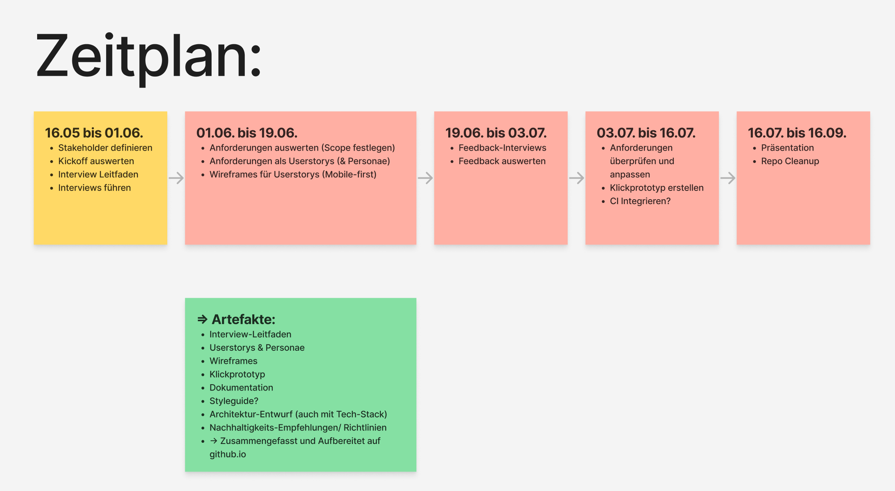

# TH Köln // Ressourcenmanagement

Im Rahmen eines hochschulinternen Projekts der _TH Köln_ am Campus Gummersbach sollen Raumbuchungen für Studierende und Lehrende konzeptionell hinterfragt und digitalisiert werden. Dazu wird eine Online-Plattform entwickelt, die unkomplizierte Raumverwaltungsprozesse und Buchungsprozesse implementiert und benutzerfreundlich aufbereitet. Nach der Anforderungsermittlung soll zusätzlich ein Architekturentwurf des Systems und erste Prototypen entwickelt werden. Bei diesen Entwürfen soll eine hohe Gewichtung auf die Nachhaltigkeit des Systems gelegt werden. In der Vergangenheit hat sich an der _TH Köln_ oft gezeigt, dass nicht-nachhaltig geplante Systeme für die Systempflegenden und -nutzenden einen nicht zu vernachlässigenden Mehraufwand erzeugen und damit eine erhöhte Unzufriedenheit einhergeht. Ebenfalls entsteht das Problem, dass Software nach einem kurzen Nutzungszeitraum nur noch schwierig an neue Anforderungen angepasst werden kann. Aus diesem Grund wird bei der Planung und Implementierung eine hohe Gewichtung auf Nachhaltigkeit im ökonomischen Sinn gelegt.

## Projektfortschritt

Folgende Abbildung zeigt den Projektfortschritt anhand der Meilensteine und Artefakte. Klicke auf einen Meilenstein um zur jeweiligen Dokumentation und den Ergebnissen zu gelangen.


## Termine

| Datum                  | Thema                          | Ort                                         | Protokoll                                              |
| ---------------------- | ------------------------------ | ------------------------------------------- | ------------------------------------------------------ |
| 26.04.22 16:30         | _Startschuss_                  | Zoom BE                                     | [Protokoll](./protokolle/00_Prot_26-04-22.md)          |
| 04.05.22 12:00         | _Meeting mit Stundenplan-Team_ | Campus GM - Raum: 3204                      | [Protokoll](./interviews/interview-Stundenplanteam.md) |
| 04.05.22 14:00         | _Bi-Weekly_                    | Campus GM                                   | -                                                      |
| 11.05.22 14:00         | _Review_                       | Zoom C.Noss                                 | -                                                      |
| 16.05.22 Ganztägig     | _Designsprint Tag 1_           | Campus GM                                   | [Protokoll](./protokolle/01_Prot_16-05-22.md)          |
| 18.05.22 14:00         | _Bi-Weekly_                    | Zoom BE                                     | [Protokoll](./protokolle/02_Prot_18-05-22.md)          |
| 25.05.22 14:00         | _Review_                       | Zoom C.Noss                                 | [Protokoll](./protokolle/03_Prot_25-05-22.md)          |
| 01.06.22 14:00         | _Bi-Weekly_                    | Zoom BE                                     | [Protokoll](./protokolle/04_Prot_01-06-22.md)          |
| ~~08.06.22 14:00~~     | ~~Review~~                     | (Ausgefallen, da Interviews geführt wurden) | [Protokoll](./protokolle/05_Prot_08-06-22.md)          |
| 15.06.22 14:00         | _Review_                       | Zoom C.Noss                                 | [Protokoll](./protokolle/06_Prot_15-06-22.md)          |
| 22.06.22               | _Planung_                      | Zoom BE                                     | [Protokoll](./protokolle/07_Prot_22-06-22.md)          |
| 29.06.22 09:00 - 17:00 | _Designsprint Tag 2_           | TBA                                         | [Protokoll](./protokolle/08_Prot_29-06-22.md)          |
| 12.07.22               | _Feedback mit Stundenplan-Team_| Campus GM - Raum: 3204                      | [Protokoll](./protokolle/09_Prot_12-07-22.md)          |
|                        |                                |                                             |                                                        |



### Zoom BE

```
https://th-koeln.zoom.us/j/8542457439

Meeting-ID: 854 245 7439
Kenncode: pass
```

## Sonstiges

### Links

[Miro Board](https://miro.com/app/board/o9J_kgMy_lc=/) - Brainstorming und Konzepte

[Figma](https://www.figma.com/file/XmxGih73XA6zbU6UN1y1mb/Wireframes?node-id=0%3A1) - Wireframes und Designs

### Ressourcen

[Designsprint](https://koos.github.io/mi-master-vuk/) - Ressourcen Sammlung Jan Kus  
[Designsprint](https://designsprintkit.withgoogle.com/methodology/overview) - Google Ressource
