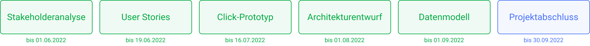

# TH Köln // Raum- und Ressourcenbuchung

Im Rahmen eines hochschulinternen Projekts der _TH Köln_ am Campus Gummersbach sollen Raumbuchungen für Studierende und Lehrende konzeptionell hinterfragt und digitalisiert werden. Dazu wird eine Online-Plattform entwickelt, die unkomplizierte Raumverwaltungsprozesse und Buchungsprozesse implementiert und benutzerfreundlich aufbereitet. Nach der Anforderungsermittlung soll zusätzlich ein Architekturentwurf des Systems und erste Prototypen entwickelt werden. Bei diesen Entwürfen soll eine hohe Gewichtung auf die Nachhaltigkeit des Systems gelegt werden. In der Vergangenheit hat sich an der _TH Köln_ oft gezeigt, dass nicht-nachhaltig geplante Systeme für die Systempflegenden und -nutzenden einen nicht zu vernachlässigenden Mehraufwand erzeugen und damit eine erhöhte Unzufriedenheit einhergeht. Ebenfalls entsteht das Problem, dass Software nach einem kurzen Nutzungszeitraum nur noch schwierig an neue Anforderungen angepasst werden kann. Aus diesem Grund wird bei der Planung und Implementierung eine hohe Gewichtung auf Nachhaltigkeit im ökonomischen Sinn gelegt.

## Projektfortschritt

Folgende Abbildung zeigt den Projektfortschritt anhand der Meilensteine und Artefakte. Klicke auf einen Meilenstein um zur jeweiligen Dokumentation und den Ergebnissen zu gelangen.

## Projektdokumentation

Bist du hier um zu schauen, welche Projektergebnisse wie erziehlt wurden? Dann empfehelen wir die die Tour durch unsere Dokumentation. 

Beginne die Tour [hier](./docs/README.md).

## Links zu Projektergebnissen

Solltest du nur einen schnellen Blick auf einzelne Artefakte werfen wollen, haben wir dir hier einige Quick Links zusammengesucht. Um zu verstehen, wie diese erarbeitet wurden und für weitere Infos, empfehlen wir dir die [Tour durch die Projektdokumentation](./docs/README.md).

[Stakeholderanalyse](./docs/stakeholderanalyse)

[Interviews](./interviews)

[Anforderungen](./docs/anforderungen.md)

[User Stories](./docs/user-stories)

[Architekturentwurf](./docs/architekturentwurf)

[Datenmodell](./docs/datenmodell)

[Click-Prototyp](./docs/click-prototyp)

## Weitere Links

[Terminübersicht und Protokolle](./docs/terminuebersicht.md)

[Miro Board](https://miro.com/app/board/o9J_kgMy_lc=/) - Brainstorming und Konzepte

[Figma](https://www.figma.com/file/XmxGih73XA6zbU6UN1y1mb/Wireframes?node-id=0%3A1) - Wireframes und Designs

## Verwendete Ressourcen

[Designsprint](https://koos.github.io/mi-master-vuk/) - Ressourcen Sammlung Jan Kus

[Designsprint](https://designsprintkit.withgoogle.com/methodology/overview) - Google Ressource

## Das Projektteam

Yannic Brügger

Benedickt Engel

Tim Loges

Christopher Toth

Marius Scherff
