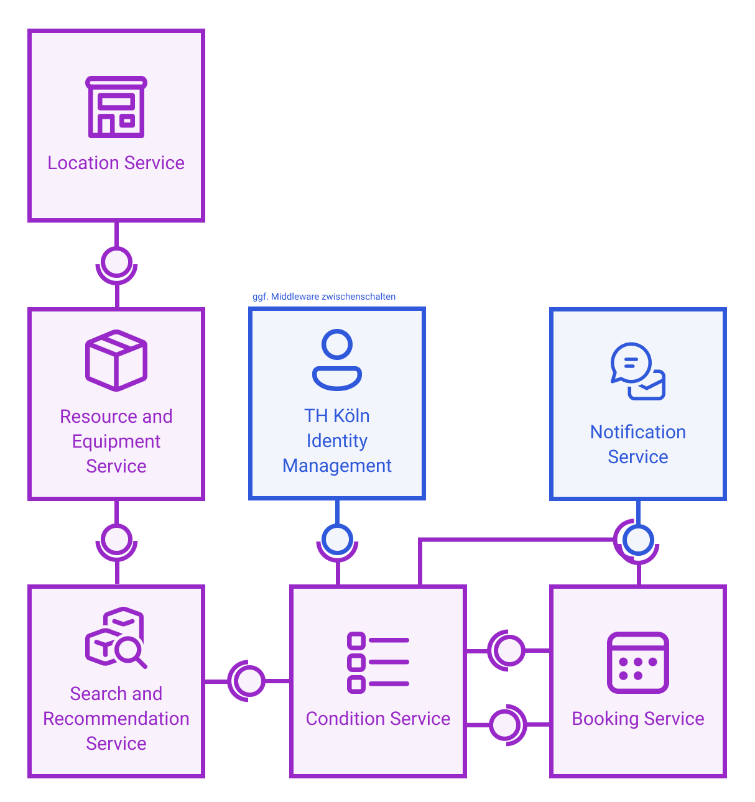

  <a href="../click-prototyp">Zurück</a>
  <a href="../datenmodell" style="float: right;">Weiter</a>

# Architekturentwurf

Bei einem Feedbacktermin mit dem ursprünglichen Projektteam hat sich herausgestellt, dass besonders ein Architekturentwurf und die Kommunikation zwischen den Komponenten für eine spätere Implementierung hilfreich sein werden.

Um ökonimische Nachhaltigkeit zu gewährleisten wird ein Architekturparadigma verwendet, das besonders die Eigenschaftem Anpassbarkeit und Skalierbarkeit unterstützt. Üblicherweise wird für diese Anforderungen eine Microservice-Architektur verwendet.

Jede Komponente kann über eigene Benutzeroberflächen verfügen oder APIs als Schnittstellen zu seperaten Benutzeroberflächen anbieten. Um ein einheitliches 
Der Architketurentwurf unterschiedet zwischen drei Kategorien. Die Kategorie *IT Landscape* (blau) beschreibt Services, die übergreifend in der TH Verwendet werden und gegebenenfalls schon bestehen. Die zweite Kategorie *Booking Platform* beinhaltet alle Komponenten, die dediziert für das Projekt geschaffen werden. Diese können aber zukünftig auch von anderen Anwendungen konsumiert werden. In der letzten Kategorie *UI* werden Komponenten deiniert, die als Benutzeroberfläche direkt von den Anwender:innen verwendet werden können und alle Funktionalitäten des Systems bereitstellen.

![Architekturentwurf aufgeteilt in drei Kategorien. Die Kategorie IT Landscape beinhaltet die übergreifenden (ggf. schon bestehenden) Komponenten Transponder Management, Identity Management, Notification Service. Die zweite Kategorie Booking Platform beinhaltet die Komponenten Condition Service, Search and Recommendation Service, Resource and Equipment Service, Booking Service, Location Service und ggf. ein zusätzlicher Identity Service als Middleware. Zusätzlich soll es zwei UI Komponenten geben. Admin UI und Booking UI.](../assets/architektur-grobentwurf.png)

Die abgebildeten Komponenten werden in folgender Auflistung erläutert:
- Der *Location Service* verwaltet Standorte, Gebäude und Räume.
- Der *Equipment Service* verwaltet die Ausstattung von Räumen und beinhaltet zusätzlich Equipment, das mobil und dadurch nicht einem Raum zuzuordnen ist.
- Der *Identity Service* verwaltet Accounts, Gruppen und ihre Berechtigungen.
- Der *Search Service* sucht anhand von Filtern und Bedingungen verfügbare Ressourcen für eine bestimmten Zeitraum. Er empfiehlt außerdem andere, beziehungsweise ähnliche Ressourcen.
- Der *Booking Service* erlaubt es Identitäten, Buchungen von Ressourcen vorzunehmen. Ressourcen sind entweder Räume samt Ausstattung oder mobiles Equipment.
- Der *Condition Service* implementiert Abfragen, ob eine bestimmte Aktion einer Identität erlaubt oder unerlaubt ist. Ist die Bedingung eine Freigabe durch eine Person, wird diese digital beantragt.  

In einer zweiten Iteration wurde die Kommunikation unter den Komponenten definiert. Dabei wurde auch die Kommunikationsrichtung hinausgearbeitet. Komponenten, die einen Service anbieten, kennen nicht die konsumierenden Komponenten. So kann eine lose Kopplung erzielt werden.

  <a href="../click-prototyp">Zurück</a>
  <a href="../datenmodell" style="float: right;">Weiter</a>

