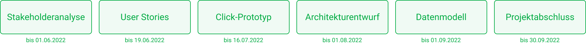

  <a href="./projektabschluss">Zurück</a>
  <a href="./">Zum Inhaltsverzeichnis</a>

# Ausblick

Nach Abschluss unseres Projekts und der Präsentation beim Medieninformatik-Kickoff zum Wintersemester, wird das Projekt voraussichtlich an eine neue Projektgruppe übertragen. Diese Gruppe wird sich mit der Entwicklung im _Projekt 2: Entwicklung_, befassen und somit unser Konzept in einen ersten Prototyp überführen.

  <a href="./projektabschluss">Zurück</a>
  <a href="./">Zum Inhaltsverzeichnis</a>

