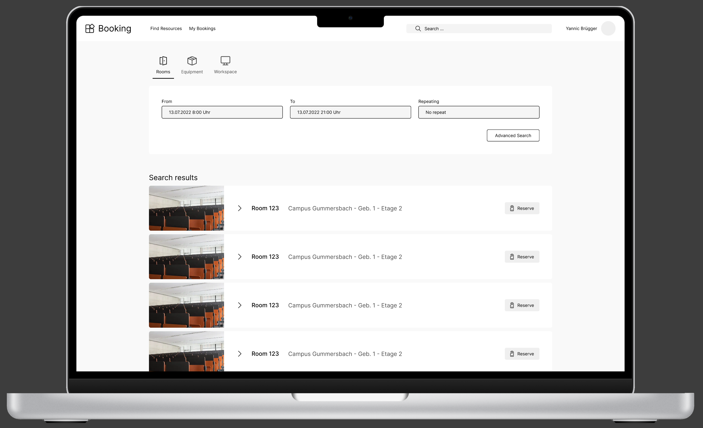

  <a href="../user-stories">Zurück</a>
  <a href="../architekturentwurf">Weiter</a>

# Click-Prototyp

Anhand der Anforderungen, Personae und User Stories, welche im vorherigen Meilenstein aufgestellt wurden wurde im weiteren feingranulare Wireframes aufgestellt und in einen Click-Prototypen überführt. Dieser kann in [in Figma](https://www.figma.com/proto/XmxGih73XA6zbU6UN1y1mb/Wireframes?node-id=6%3A56&scaling=scale-down&page-id=0%3A1&starting-point-node-id=6%3A2) getestet werden. 

## Einzelne Views des Prototypen:

### Landingpage
Die [Landingpage](https://www.figma.com/file/XmxGih73XA6zbU6UN1y1mb/Wireframes?node-id=6%3A56) auf welche man nach dem Login weitergeleitet wird stellt zugleich die Suche dar. Hier kann direkt nach Räumen, Ressourcen oder Arbeitsplätzen gesucht werden und daraufhin auch direkt reserviert werden.

### Raum Detailseite
Durch das auswählen eines Raums aus der Liste gelangt man direkt auf die [Detailseite](https://www.figma.com/file/XmxGih73XA6zbU6UN1y1mb/Wireframes?node-id=13%3A4139) des Raums. Hier sind nochmal weitere Informationen zu finden, wie beispielsweise die Bestuhlungsart und -anzahl, Ressourcen im Raum und Informationen falls Ressourcen des Raums defekt sein sollten.

### Buchungsübersicht
Zusätzlich wurde noch eine [Bungsübersicht](https://www.figma.com/file/XmxGih73XA6zbU6UN1y1mb/Wireframes?node-id=13%3A521) konzeptioniert. In dieser Übersicht können einzelne Buchungen gecancelt werden um den Raum wieder frei zugeben, sowie in den Raum eingecheckt werden.

> Da in einem Feedbackgespräch mit dem Studenplanteam, Prof. Zühlke und Prof. Noss weitere Mockups, Styleguide, mobile Version und ähnliche Layout-Artefakte niedrig priorisiert wurden, wurde an diesem Stand nicht weitergearbeitet (Siehe [Scope](../scope-und-out_of_scope.md))

  <a href="../user-stories">Zurück</a>
  <a href="../architekturentwurf">Weiter</a>

