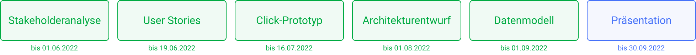

  <a href="../click-prototyp">Zurück</a>
  <a href="../datenmodell" style="float: right;">Weiter</a>

# Datenmodell

<!-- TODO: Datenmodell hinzufügen -->

  <a href="../architekturentwurf">Zurück</a>
  <a href="../projektabschluss">Weiter</a>

