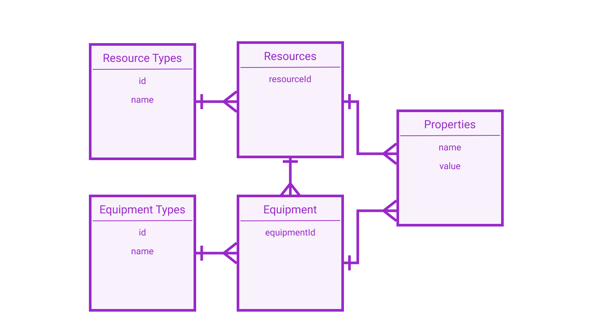

  <a href="../architekturentwurf">Zurück</a>
  <a href="../projektabschluss">Weiter</a>

# Datenmodell

Manche der im Architekturentwurf vorgestellten Komponenten benötigen eine interne Datenhaltung. Es werden ERDs für die jeweiligen Services vorgestellt, die die grobe Datenstruktur beschreiben. Dabei muss die finale Datenhaltung nicht zwingend als relationale Datenbank implementiert sein. Es gibt auch andere Datenbankparadigmen, die diese Strukturen ähnlich abbilden können (z.B. Dokumentbasierte Datenbanken). Welches Paradigma für welche Komponente verwendet werden sollte, muss kurz vor beziehungsweise zur Implementationszeit entschieden werden.

## Condition Service

Der Condition Service verfügt über die komplexeste Datenhaltung der Komponenten. Es werden *Conditions* (Bedingungen) verwaltet, die von einem Bedingungstypen sind und über Eingabeparameter verfügen. Eine Bedinung muss einer Ressource zugeordnet werden. Wird aus dem Booking Service eine Buchung für eine Ressource angefragt, wird ein *Check* (Abfrage) im Condition Service erstellt. Diese Abfrage gibt die Parameterwerte an die jeweilen Bedingungen weiter und überprüft den Status.

## Booking Service

Der Booking Service verwaltet ausschließlich Buchungen von Ressourcen. Alle weiteren Informationen werden aus den anderen Services abgefragt und Referenzen auf Datensätzen aus anderen Services abgespeichert.

## Equipment Service

Dieser Service verwaltet Ressourcen und Eqipment. Ressourcen sind grundsätzlich alles, was buchbar ist wie Räume oder ein mobiles Whiteboard. Eine Ressource kann über Equipment verfügen wie beispielsweise die Ausstattung eines Raumes. Equipment und Ressourcen können durch weitere dynamische Eigenschaften erweitert werden.

## Location Service

Als Stammdatenservice verwaltet der Location Service Daten zu *Locations* (Standorte wie z.B. Campus) *Buildings* (Gebäuden) und *Rooms* (Räumen).

  <a href="../architekturentwurf">Zurück</a>
  <a href="../projektabschluss">Weiter</a>

