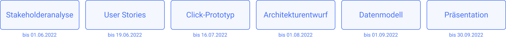

  <a href="../projektkontext">Zurück</a>
  <a href="../stakeholderanalyse">Weiter</a>

# Projektziel

Ziel des Projekts ist hierbei die Konzeption der Anwendung welche für die Raum- und Ressourcenbuchung genutzt werden kann. Diese Konzeption unterteilt sich in einige Projektziele und-artefakte:

- Stakeholderanalyse (Mögliche Nutzende analysieren und verstehen)
- Anforderungsanalyse (Welche funktionen benötigt die Anwendung)
- Prototypische Darstellung (in Form von Wireframes und eines Click-Prototypen)
- Architekturentwurf

Anhand dieser Artefakte soll in einem weiteren Projekt eine schnelle Umsetzung ermöglicht werden.

Eine genauere Aufstellung des Scopes und welche Artefakte es nicht mehr in den Rahmen des Projektes geschafft haben kann [hier](./scope-und-out_of_scope.md) nachgelesen werden. 

  <a href="../projektkontext">Zurück</a>
  <a href="../stakeholderanalyse">Weiter</a>

