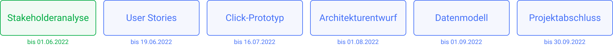

  <a href="../projektziel">Zurück</a>
  <a href="../user-stories">Weiter</a>

# Stakeholderanalyse

Da die genauen Anforderung noch nicht eindeutig identifiziert wurden, sollten diese durch Interviews herausgearbeitet werden. Um zu identifizieren, wer interessante Interviewpartner:innen sind, wurde eine Stakeholderanalyse durchgeführt.

Hierfür wurden alle möglichen Nutzenden des Systems analysiert. Desweiteren wurden alle identifizierten Stakeholder in eine Power-Interest-Matrix eingordnet, um daran die Priorität der Nutzenden festzulegen.

## Interviews

Daraufhin wurden Kontakte für die jeweiligen Stakeholder gesammelt um möglichst viele dieser zu interviewen. Außerdem wurden sowohl Interviewfragen aufgestellt, als auch ein Interviewleitfaden, welcher den groben Ablauf festlegte. Beides ist [hier](../Interviewfragen.md) zu finden.

## Interviewergebnisse

Die Ergebnisse und Antworten aus den Interviews wurden protokolliert und lassen sich [hier](../../interviews/README.md) finden.

Im nächsten Schritt werden diese ausgewertet und in Anforderungen überführt.

  <a href="../projektziel">Zurück</a>
  <a href="../user-stories">Weiter</a>

