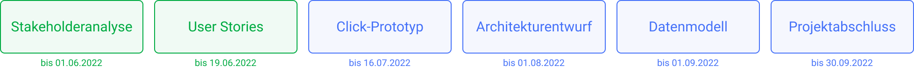

  <a href="../stakeholderanalyse">Zurück</a>
  <a href="../click-prototyp">Weiter</a>

# User Stories

## Interviewauswertung und Anforderungen
Anschließend an die Interviews wurden die [Interviewergebnissen](../../interviews/README.md) ausgewertet. Auch hierür wurde ein [Leitfaden](../auswertungsleitfaden.md) erstellt um aus den Interviews resultierende Anforderungen nach dem gleichen Aufbau aufzustellen.

Diese Anforderungen wurden daraufhin zusammen im Projektteam gesammelt und in eine [vollständige Liste](../anforderungen.md) übertragen.

## Personae
Um die Anforderungen in einen Zusammenhang mit den analysierten Stakeholdern und deren Bedürfnisse zu setzen wurden außerdem beispielhaft [Personae](./personae.md) aufgestellt (Auszug):

### Professor / Dozent
**Prof. Dr. Wilhelm Münster (63 Jahre alt)**
- Professor für allgemeine Informatik, hatte bereits schon an zwei anderen Hochschulen einen Lehrauftrag, zuvor einige Jahre bei SAP.
- gute Computerkenntnisse
- benötigt für seine Lehrveranstaltungen sowohl Hörsäle als auch Seminarräume.
- Seine Seminare finden unregelmäßig statt
- Kennt den Campus einigermaßen, seine Module haben bisher immer im selben Gang wie sein Büro stattgefunden.
- Einstellung zum Produkt: Ist mit der bisherigen Raumvergabe zu frieden; Findet die Idee des Buchungssystems überflüssig.

### Studierende
**Dirk Amin (18 Jahre alt)**
- studiert Ingenieurswesen im ersten Bachelorsemester, hat vor einigen Monaten sein Abitur in Frankfurt gemacht.
- sehr gute Computerkenntnisse
- benötigt öfters unter der Woche (1-3x) einen Arbeitsplatz in einem Labor der Ingenierwissenschaften um ein Projekt für ein Modul fertig zu stellen.
- Kennt das Hauptgebäude und das Mensa-Gebäude. Benötigt eine Karte um neue Räume zu finden. 
- Einstellung zum Produkt: Skeptisch; neutral; Hofft das es ihm bei der Orientierung hilft und er ohne Probleme einen Laborarbeitsplatz bekommt

## User Stories

Zusätzlich wurden diese Personae mit User Stories, welche aus den Anforderungen resultierten verbunden um einige Anwendungsfälle der Software besser zu beschreiben:

### US1 - Raum für Lehrveranstaltung (Vorlesung)
Als Prof. Dr. Münster möchte ich einen Raum für meine Vorlesung buchen. Erwartungsgemäß nehmen durchschnittlich etwa 45 Personen an dieser Teil, da es sich um eine Vorlesung handelt empfiehlt sich ein Hörsaal. Den Raum benötige ich die komplette Vorlesungszeit einmal die Woche immer am selben Tag, zur selben Zeit. 
Leider bin ich für 2 Wochen in diesem Zeitraum auf Forschungsreise, in dieser Zeit findet die Vorlesung über Zoom statt.

Anforderungen in dieser User Story (Auszug):
- Wenn Nutzende(Lehrende, Institutsleitung) einen Raum ausgewählt haben und dieser blockiert ist, muss das System anzeigen wer diesen blockiert hat.
- Wenn Nutzende einen Raum für eine Zeitspanne (wiederkehrende Termine) blockiert haben, muss das System eine Möglichkeit bieten einzelne Termine wieder freizugeben.
- Wenn Nutzende einen Raum buchen möchten, muss das System einen Grund verlangen.
- Wenn Nutzende einen Raum auswählen, muss das System die Art des Raumes angeben.
- Wenn ein Raum durch Studierende geblockt ist muss das System Lehrenden erlauben diese Blockierung zu überschreiben.
- Das System muss den Semesterplan (& Feiertage) berücksichtigen.
- Wenn Nutzende eine Suche starten (Räume filtern), sollte das System ähnliche Räume anzeigen/vorschlagen.

### US2 - Raum für ein Seminar, zusätzlich andere Ressourcen
Als Maria biete ich ein Seminar zum Thema Rechtsformen an. Dieses findet einmal im Monat statt und lebt durch die Interaktion mit den Studierenden, welche unteranderem in 6er-Gruppen zusammenarbeiten. Da das Seminar jeweils 5 Stunden geht und nicht immer der selbe Raum möglich ist, habe ich mich schon auf unterschiedliche Räume eingestellt. Jedoch sollte jeder  dieser Räume die Möglichkeit bieten 4 Tischgruppen a 6 Plätze zu bilden. 
Zusätzlich wird in der ersten Veranstaltung ein Overhead-Projektor benötigt.

Anforderungen in dieser User Story (Auszug):
- Wenn Nutzende(Lehrende, Institutsleitung) einen Raum ausgewählt haben und dieser blockiert ist, muss das System anzeigen wer diesen blockiert hat.
- Wenn Nutzende einen Raum auswählen, muss das System (fein gegliedert) darstellen, welche Austattung dort vorhanden ist.
- Wenn Nutzende einen Raum buchen möchten, muss das System einen Grund verlangen.
- Wenn Nutzende einen Raum auswählen, muss das System die Art des Raumes angeben.
- Wenn ein Raum durch Studierende geblockt ist muss das System Lehrenden erlauben diese Blockierung zu überschreiben.
- Das System muss den Semesterplan (& Feiertage) berücksichtigen.
- Wenn Nutzende eine Suche starten (Räume filtern), sollte das System ähnliche Räume anzeigen/vorschlagen.
- Wenn Nutzende einen Raum ausgewählt haben, sollte das System ähnliche Räume anzeigen/vorschlagen.
- Wenn Nutzende eine bestimmte Mobile Ausstattung suchen, sollte das System anzeigen in welchem Raum sich die Mobile Ausstattung befindet.
- Das System soll eine Kalenderansicht über die Buchungen eines Raumes zur Verfügung stellen.

### US3 - Arbeitsplatz mit Workstation
Als Tanja habe ich die Abgabe für das Modul Computergrafik noch nicht fertiggestellt welches in 2 Tagen abgegeben werden muss. Hierbei benötige ich eine Workstation mit min. 8GB Ram für etwa 6 Stunden. 

Anforderungen in dieser User Story (Auszug):
- Das System muss den Nutzenden auffordern sich ein- und auszuchecken.
- Das System muss den Semesterplan (& Feiertage) berücksichtigen.
- Das System sollte erlauben einzelne Plätze in PC-Pools von anderen Studienrichtungen zu buchen.

  <a href="../stakeholderanalyse">Zurück</a>
  <a href="../click-prototyp">Weiter</a>

