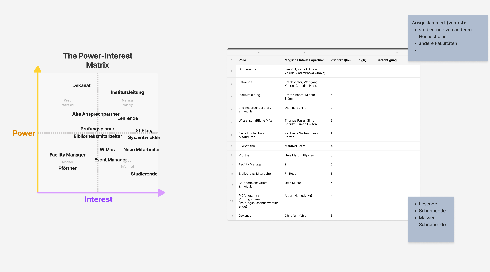

# Protokoll Designsprint #1 16.05.22

Anwesend: Chris, Marius, Yannic, Tim, Benedikt

Protokollant: Benedikt

Sprint-Leiter: -

## Tops

- Wie sieht unser Zeitplan aus, welche Deadlines wollen wir einhalten?
- Was für Artefakte/Prototyp sollen am Ende raus kommen? (-> Übergabe an nächstes Team)
- Stakeholder-Analyse
- Interview-Fragen aufstellen
- Anforderungen und Priorisierung (Was wäre für uns wichtig?)

## Outcomes

### Zeitplan & Artefakte
**Design-Sprint 1 (16.05. - 01.06.22)**
Todos & resultierende Artefakte:
- Interview-Leitfaden mit Fragen
- Stakeholder definieren und für Interviews anfragen
- Kickoff mit Stundenplanteam auswerten
- Interviews führen

**Design-Sprint 2 (01.06. - 19.06.22)**
Todos & resultierende Artefakte:
- Anforderungen auswerten & Scope festlegen
- Anforderungen als Userstorys mit zugehörigen Personaes aufstellen
- Wireframes für die Userstorys anfertigen (Mobile-first-Ansatz)

**Design-Sprint 3 (19.06. - 03.07.22)**
Todos & resultierende Artefakte:
- Feedback-Interviews führen
- Userstorys anhand dieser anpassen
- Wireframes überarbeiten 

**Design-Sprint 3 (19.06. - 03.07.22)**
Todos & resultierende Artefakte:
- Weiteres Feedback einholen
- Prototypisierte Anwendung entwickeln (POC)

**Vorlesungsfreie Zeit / Puffer (16.07.-16.09.22)**
Todos & resultierende Artefakte:
- Prototypisierte Anwendung weiterentwickeln (POC)
- Präsentation 
- Repo-Organisation überprüfen und gegebenfalls (für bessere Übergabe) anpassen
- Übergabe-Artefakte fertigstellen

### Stakeholderanalyse

### Anforderungen & Ideen von unserer Seite

#### Was sind Ressourcen? 
- Räume uns Ausstattung (mit flexibler Kapazität)
- Mobile Ausstattung
- Metadaten
- Transponder
- MI-Verleih (Kameras, Ton & Licht)
- Keine Consumables!
- Platzbuchung (bspw. im PC-Pool)
- Sprechstunde
- Raumarten

#### Wer darf Ressourcen nutzen?
- Hierarchie/Prioritäten
- Überbuchungszeitraum
- Authentisierung/ Authorisierung -> Wer? 
- Allow- & Deny-Listing
- Genehmigungen
- Kontingente 

#### Wo sind Ressourcen?
- Darstellung als Karte?
- Wie komme ich hin?
- Welche Ressourcen sind da?
- QR-Codes || Displays an den Räumen

#### Wie kann man buchen? 
- Mobile First
- Webanwendung
- Keine App
- Gruppenbuchung
- Check-In
- Dauerbuchung
- Tages- und Stundengenau

#### Technische Dinge
- API anbieten
  - Stundenplansystem
  - Prüfungssystem
- Modularität (Lose Kopplung)
- Nachhaltigkeit des Codes
- Raum On-/Off-/Change-Boarding (Räume können sich verändern)
- Stammdatenmanagment

#### Ideensammlung / Nice to Have
- Inventur durch Nutzende (aka Du bist gerade da, wie sieht der Raum aus, fehlt was?)
- Gameification
- Künstliche Verknappung
- Reporting und Feedback (Stifte, Kreide, Consumables), Sauberkeit, ist etwas Kaputt?
- Bluetooth-beacons für Navigation
- Transponder- Multimapping

### Interviewfragen
Siehe [Interviewfragen in den Docs](../docs/Interviewfragen.md).

